> **블로그 참고**
>
> 해당 내용은 [https://seungki1011.github.io/posts/cicd-github-action/](https://seungki1011.github.io/posts/cicd-github-action/)에도 포스팅 했습니다.

<br>

---

## 🌿 브랜치 설명

* **`main`**: 조건문을 적용하지 않은 워크플로우
* **`dev`**: `main`과 동일
* **`test`**: `main`과 동일. 해당 브랜치에 PR을 넣으면 워크플로우가 트리거됩니다.
* **`using-if`**: 조건문을 사용한 워크플로우

<br>

아래 브랜치는 `main`을 기반으로 합니다.

* **`slack/slack-github-action-bug`**: `slackapi/slack-github-action@v1.27.0`을 사용합니다. 버그가 있습니다.
* **`slack/slack-github-action-workaround`**: `slackapi/slack-github-action@v1.27.0`을 사용하지만, 버그를 우회한 방법입니다.
* **`slack/action-slack`**: `8398a7/action-slack`을 사용합니다

<br>

---

## 🗣️ GitHub Actions 소개

**GitHub Actions**는 GitHub에서 제공하는 **자동화 도구**로, CI/CD(지속적 통합 및 지속적 배포) 파이프라인과 같은 **자동화 워크플로우를 구성할 수 있습니다**. GitHub Actions는 GitHub 리포지토리와 통합되어 있어, 개발자들이 **Push**나 **Pull Request**와 같은 **이벤트에 따라 자동으로 워크플로우를 실행**하고, 소프트웨어 빌드, 테스트, 배포 등의 과정을 자동화할 수 있습니다.

<br>

> **CI/CD외의 작업에도 사용할 수 있습니다**
>
> 위에서도 설명했듯이 깃헙 이벤트와 YAML 기반의 자동화된 워크플로우를 구현하기 위해서 사용되는 도구이다. CI/CD외에도 여러가지 용도로 활용할 수 있습니다.
>
> * 예시
>   * 스케쥴링 작업: `schedule` 이벤트를 활용한 주기적인 작업 설정
>   * 프로젝트 관리: 지라와 같은 이슈 트래킹 도구와 통합한 워크플로우 생성

<br>

다음은 GitHub Actions가 사용될 수 있는 몇 가지 사용 케이스입니다.

* 깃헙 태그, 릴리즈 자동 설정
* 새로운 브랜치 생성시 특정 작업 실행
* CI/CD 파이프라인 구현
* 일정 주기 또는 특정 조건에 따른 문서화 작업

<br>

이외에도 다양한 사용 케이스가 존재합니다.

> Github Actions 문서: [https://docs.github.com/ko/actions](https://docs.github.com/ko/actions)

<br>

---

## 🎯 GitHub Actions 주요 개념

1. **워크플로우(Workflow)**
   * Github Actions에서 자동화 작업의 정의를 담고 있는 **YAML 파일**
   * `.github/workflows/` 디렉토리에 저장해서 사용합니다
   * **Enviroment**
     * **워크플로우가 배포되는 대상**을 관리하는 개념으로, 개발, 스테이징, 프로덕션 환경에 대해 서로 다른 설정과 시나리오를 적용 가능
     * 환경별로 배포 승인 절차를 추가하거나, 특정 Secret를 설정 가능
   * **Event**
     * 워크플로우가 실행되는 트리거를 의미
     * `push`, `pull_request`, `schedule`과 같은 다양한 이벤트가 존재
   * **Jobs**
     * 하나의 **워크플로우는 여러 개의 Job으로 구성**
     * Job은 **병렬로 실행 가능**
       * 예를 들어, 하나의 워크플로우에서 빌드, 테스트, 배포가 각각 다른 Job으로 병렬 수행 가능
     * 서로 다른 Job에 대한 **의존 관계에 대해 순차 실행 가능**
   * **Step**
     * 각 **Job은 여러 Step로 이루어지며**, 이 Step들은 **개별적으로 실행되는 스크립트(명령어) 또는 액션**
     * 쉽게 말해서 **Job에서 실행되는 개별 작업**이 Step
2. **액션(Action)**
   * 워크플로우 내에서 실행되는 **작업 단위**
   * 액션은 **재사용 가능한 코드 조각(컴포넌트)**으로, 특정 프로그래밍 언어의 테스트를 실행하거나, 클라우드에 애플리케이션을 배포하는 등의 작업을 처리 가능
   * Github Marketplace에서 사전 정의된 다양한 액션들을 찾을 수 있습니다
3. **러너(Runner)**
   * 워크플로우가 실행될 때, GitHub Actions는 해당 **워크플로우를 러너라는 가상 머신에서 실행**한다
   * 러너는 GitHub에서 제공하는 **호스티드 러너** 또는 **자체 호스팅 러너**가 존재
     * **호스티드 러너(GitHub Hosted Runner)**: **GitHub에서 제공하는 기본적인 러너**로, 일반적인 OS(예: Ubuntu, Windows, macOS)를 지원하며, 각 워크플로우 실행 시 새롭게 생성되는 가상 머신
     * **자체 호스팅 러너(Self-Hosted Runner)**: 사용자가 **직접 러너를 설정하여 사용**할 수 있으며, 더 많은 제어권을 필요로 할 때 유용
       * 자체 서버나 IDC에서 실행 가능
4. **시크릿(Secrets)**
   * API 키나 비밀번호 같은 **민감한 정보를 보관하는 기능**
   * 워크플로우에서 **Secrets**로 저장된 값은 **보안된 방식으로 사용**되며, 리포지토리, 환경, 조직 등 다양한 수준에서 설정 가능

<br>

---

## 🚀 GitHub Actions 사용법

### 대략적인 과정

Github Action으로 워크플로우를 정의해서 사용하기 위해서는 크게 다음의 단계를 거칩니다.

1. **YAML 파일 작성**

   * 사용할 워크플로우를 `.github/workflows/` 디렉토리에 **YAML** 파일로 작성합니다
   * 다음의 순서의 내용을 해당 파일에 작성합니다.

2. **Triggers(Event)**

   * 워크플로우가 실행되는 이벤트를 정합니다

   * 예: `push`, `pull_request`

3. **Jobs**

   * 워크플로우는 여러개의 Job으로 나눌 수 있습니다
   * 각 Job은 병렬, 순차, 의존성에 의한 순차에 따라 실행될 수 있습니다
   * 각 Job은 서로 독립된 러너(Runner) 환경에서 동작하기 때문에, 어떤 환경(운영체제)에서 실행할지 명시해야 합니다

4. **Steps**

   * Job안에서 Step을 정의하여 각 단계를 실행합니다.
   * 각 Step은 `run`을 사용한 명령어를 실행하거나, `uses`를 사용한 액션이 될 수 있습니다

5. **Secrets**

   * 필요한 경우 민감한 정보(SSH, API 키)는 Github Secrets에 저장해서, 안전하게 관리합니다

<br>

실제 예시를 통해 알아봅시다.

현재 **자바17를 사용한 프로젝트를 진행**중이고 다음과 같은 CI 파이프라인을 구현한다고 가정해봅시다.

* `test` 브랜치로 PR 요청을 하는 경우 트리거 됩니다
* `build`와 `test`라는 2 개의 Job으로 구성됩니다. 이때 `test`는 `build`가 성공적으로 완료되어야 수행됩니다
* 각 Job의 목적은 다음과 같습니다
  * `build`: Gradle 빌드
  * `test`: Gradle 테스트
* `build` 또는 `test`가 **실패하면 CI 파이프라인도 실패하고 PR을 수행하지 못합니다**

<br>

---

### 예시 1

워크플로우를 정의해서 사용하기 위해서 `.github/workflows/` 아래에 `ci.yml`이라는 파일을 만들어서 사용합니다.

`ci.yml`

```yaml
# 워크플로우의 이름을 지정합니다
# 대시보드에서 워크플로우를 구분할 때 사용됩니다
name: CI Pipeline

# Event
on:
  pull_request: # Pull Request가 test 브랜치로 들어올 때 실행
    branches:
      - test

# Jobs: 필요한 Job을 병렬 또는 (의존성에 의해)순차적으로 실행
jobs:
  # Build Job
  build:
    runs-on: ubuntu-latest

    steps:
      # 1. 리포지토리에서 소스 코드를 체크아웃(복제)
      - name: Checkout code
        uses: actions/checkout@v3

      # 2. Gradle 라이브러리 캐싱
      - name: Cache Gradle packages
        uses: actions/cache@v3
        with:
          path: |
            ~/.gradle/caches
            ~/.gradle/wrapper
          key: ${{ runner.os }}-gradle-${{ hashFiles('**/*.gradle*', '**/gradle-wrapper.properties') }}
          restore-keys: |
            ${{ runner.os }}-gradle-

      # 3. Java 17 설치
      - name: Set up JDK 17
        uses: actions/setup-java@v3
        with:
          distribution: 'temurin'
          java-version: '17'
          
      # 4. gradlew에 권한 부여
      - name: Grant execute permission for gradlew
        run: chmod +x gradlew

      # 5. 의존성 설치 및 빌드
      - name: Build with Gradle
        run: ./gradlew build --no-daemon

  # Test Job
  # 빌드에서 테스트를 진행하기 때문에 해당 Job은 제외해도 됩니다. 그러나 needs를 설명하기 위해 편의상 추가했습니다.
  test:
    runs-on: ubuntu-latest
    needs: build  # build Job이 성공해야 실행
    
    steps:
      # 기존 체크아웃, JDK 설치 과정
      - name: Checkout code
        uses: actions/checkout@v3
      
      - name: Set up JDK 17
        uses: actions/setup-java@v3
        with:
          distribution: 'temurin'
          java-version: '17'
          
      # 6. 테스트 실행
      - name: Run tests
        run: ./gradlew test --no-daemon
```

* **Event**

  * ```yaml
    on: # 워크플로우가 실행될 조건을 정의합니다
      pull_request: # PR을 조건으로 설정합니다
        branches:
          - test # test 브랜치로 PR이 열리면 실행되도록 지정
    ```

* **Jobs**

  * ```yaml
    jobs: # 아래 계층에 수행할 Job을 정의합니다
      # (1)build라는 Job
      build:
        runs-on: ubuntu-latest # 해당 Job의 러너 환경을 지정합니다
        # 아래에 build의 Step들을 정의합니다
        step:
          # 아래 계층에 수행할 Step을 정의합니다
        	# Step 체크아웃, JDK 설정, 캐싱, 권한, 빌드...
        	
      # (2)test라는 Job
      test:
        runs-on: ubuntu-latest
        needs: build  # build가 성공적으로 완료되어야 수행된다는 의미
    ```

  * `runs-on`: **Job**이 실행될 환경을 지정합니다. 위 예시의 경우 `ubuntu-latest`를 통해 최신 버전의 Ubuntu 환경에서 동작하도록 합니다. **Job들은 서로 별개의 환경을 사용**합니다. 

  * `needs`: **Job**의 의존성을 지정합니다

  * 의존하는 **Job**을 명시적으로 **지정하지 않는 경우 병렬로 수행**됩니다

* **Steps**

  * ```yaml
    # 하나의 Job안에 정의된 Step들은 기본적으로 순차적으로 실행됩니다
    steps:
          # 1. 리포지토리에서 소스 코드를 체크아웃(복제)
          - name: Checkout code # name으로 각 Step의 이름을 부여합니다
            uses: actions/checkout@v3 # uses를 통해 액션을 호출합니다
    
          # 2. Gradle 라이브러리 캐싱
          - name: Cache Gradle packages
            uses: actions/cache@v3
            with: # with를 통해 액션에 대한 추가적인 설정을 지정할 수 있습니다
              path: |
                ~/.gradle/caches
                ~/.gradle/wrapper
              key: ${{ runner.os }}-gradle-${{ hashFiles('**/*.gradle*', '**/gradle-wrapper.properties') }}
              restore-keys: |
                ${{ runner.os }}-gradle-
    
          # 3. Java 17 설치(JDK 설치)
          - name: Set up JDK 17
            uses: actions/setup-java@v3
            with:
              distribution: 'temurin'
              java-version: '17'
              
          # 4. gradlew에 권한 부여
          - name: Grant execute permission for gradlew
            run: chmod +x gradlew # run으로 직접 명령어를 실행할 수 있습니다
    
          # 5. 의존성 설치 및 빌드
          - name: Build with Gradle
            run: ./gradlew build --no-daemon
    ```

  * `steps`: 아래 계층에 순차적으로 수행할 **Step**들을 명시합니다

  * `name`: **Step**에 부여할 이름입니다. GitHub Action 로그에 표시됩니다.

  * `uses`: **액션(Action)을 호출**하기 위해서 사용합니다

  * `run`: **직접 명령어를 실행**하기 위해서 사용합니다

  * `id`: 예시에서 사용하지 않았지만 `id`를 부여해서 다른 **Step**이 `id`를 사용해서 해당 `id`의 **Step**의 출력값이 상태를 참조해서 사용할 수 있습니다.

<br>

---

### `uses` 필드

**`uses` 필드를 자세히 살펴보자.**

`uses` 필드는 GitHub Actions의 워크플로우 파일에서 **다른 사람이 작성한 액션(Action)을 호출**할 때 사용되는 필드입니다. 즉, `uses` 필드를 통해 **GitHub Marketplace에 등록된 액션이나 공용 리포지토리에서 제공하는 액션을 가져와서 사용**할 수 있습니다.  

다음과 같은 구조를 사용합니다.

```yaml
uses: {repository}@{version, branch, commit}
```

* **repository**: 액션이 위치한 리포지토리의 경로를 지정합니다. 예를 들어 `actions/checkout`은 `actions`라는 사용자 또는 조직이 만든 `checkout`이라는 리포지토리를 의미합니다.
* **version, branch, commit**: 액션의 특정 버전(`@v2`), 브랜치(`@main`), 또는 커밋 해시(`@a1b2c3d4`)를 지정할 수 있습니다

<br>

정리하자면 `uses` 필드를 통해서 특정 **액션을 재사용**하고 해당 **액션에 대한 버전 지정**을 할 수 있습니다.

<br>

> **액션 커스터마이징**
>
> 커스터마이즈하고 싶은 액션의 레포지토리를 포크하고, 커스텀 후에 기존 사용자 또는 조직 대신 내 깃헙 아이디를 사용하면 커스텀한 액션을 사용할 수 있습니다.
>
> * 예: `slackapi/slack-github-action`을 포크하고 필요한 부분을 커스터마이징 후에 `myrespository/slack-github-action` 같은 형태로 사용이 가능합니다

<br>

---

### `run` 필드

이번에는 **`run` 필드를 자세히 살펴봅시다.**

`run` 필드는 GitHub Actions의 워크플로우에서 **직접 명령어를 실행**할 때 사용됩니다. 주로 **쉘 스크립트나 단일 명령어를 실행하는 데 사용**되며, CI/CD 파이프라인의 다양한 단계에서 커스텀 작업을 수행할 수 있게 해줍니다. `run` 필드를 통한 명령어를 사용해서 **빌드 도구를 사용하여 애플리케이션을 빌드하거나 테스트 스크립트를 실행**할 수 있습니다.

<br>

여러 명령어를 한번에 실행하는 것도 가능합니다.

```yaml
# 한번에 여러 명령어를 사용하는 예시
- name: Install dependencies and build
  run: |
    npm install
    npm run build
```

<br>

---

## 🗃️ 캐싱(Caching)

CI 파이프라인에서 라이브러리를 캐싱하는 것은 **빌드 시간을 단축**하고 **리소스 사용량을 줄이는 데 효과적**입니다. 특히, Gradle과 같은 빌드 도구를 사용하는 경우 의존성 **캐싱을 통해 매번 라이브러리를 다시 다운로드하지 않도록** 할 수 있습니다.

캐싱은 캐시 액션인 `actions/cache`를 통해서 설정할 수 있습니다.

<br>

```yaml
- name: Cache Gradle packages
  uses: actions/cache@v3 # GitHub에서 제공하는 액션인 cache@v3 사용
  with:
    path: | # 캐시 경로 지정
      ~/.gradle/caches
      ~/.gradle/wrapper
    key: ${{ runner.os }}-gradle-${{ hashFiles('**/*.gradle*', '**/gradle-wrapper.properties') }}
    restore-keys: |
      ${{ runner.os }}-gradle-
```

* `path`: 캐싱할 경로를 지정합니다
  * `~/.gradle/caches`: Gradle이 다운로드한 의존성(라이브러리)이 저장되는 경로
  * `~/.gradle/wrapper`: Gradle 래퍼의 캐시 경로

<br>

**`key`와 캐시 무효화**에 대해서 알아봅시다.

```yaml
key: ${{ runner.os }}-gradle-${{ hashFiles('**/*.gradle*', '**/gradle-wrapper.properties') }}
```

* `key`는 다음의 역할을 가집니다
  * **캐시 식별**: `key`는 저장된 캐시를 식별하고 검색하는 데 사용됩니다. 동일한 `key`를 가진 캐시가 존재하면, 해당 캐시가 복원됩니다.
  * **캐시 업데이트**: 캐시를 저장할 때 `key`를 사용하여 기존 캐시와 구분합니다. `key`가 변경되면 새로운 캐시가 생성됩니다.

* **캐시 무효화**
  * 프로젝트의 **의존성이나 Gradle 설정 파일이 변경**될 경우, **이전 캐시가 더 이상 유효하지 않게 됩니다**. 예를 들어, `build.gradle` 파일이나 `gradle-wrapper.properties` **파일이 수정되면 새로운 캐시가 필요**할 수 있습니다.
  * 이 설정에서는 `build.gradle`, `settings.gradle`, `gradle-wrapper.properties` 파일의 해시 값을 기반으로 `key`를 생성합니다다. 이러한 **파일이 변경되면 해시 값이 바뀌고, 캐시 키도 변경되면서 캐시가 무효화**됩니다.

<br>

```yaml
restore-keys: |
      ${{ runner.os }}-gradle-
```

* **`restore-keys`**
  * `key`와 **정확히 일치하지 않는 경우에도 유사한 키를 가진 캐시를 복원**할 수 있습니다
  * **`key`와 비슷한 값을 가진 캐시를 찾기 위한 보조 역할**을 한다고 보면 됩니다

* `${{ runner.os }}-gradle-`이라는 prefix 기준으로, 캐시에 저장된 `key` 중에서 prefix를 포함하는 `key`를 찾고 가장 최근의 캐시를 복원합니다

<br>

정리하자면 캐시 설정을 통해서 다음의 효과를 얻을 수 있습니다.

* **빌드 시간 단축**: 캐시된 의존성을 재사용하여 의존성 다운로드 시간을 줄이고, 전체 빌드 시간을 단축
* **네트워크 트래픽 절약**: 의존성을 매번 다운로드하지 않고, 캐시에서 복원함으로써 네트워크 사용량을 줄임

<br>

> **`gradle/gradle-build-action`을 사용할 수 있다?**
>
> 이 액션은 `gradle`에서 제공하는 액션입니다. Gradle을 사용해서 빌드하는데 도움을 줍니다. 해당 액션을 사용하면 다음의 이점을 얻을 수 있습니다.
>
> * `run`을 사용하지 않고 Gradle 관련 설정과 명령어를 더 쉽게 실행할 수 있도록 도와준다
> * 기존의 `actions/cache`를 사용하지 않고 캐싱 관련 설정을 할 수 있다
>
> <br>
>
> 간단히 사용법을 알아봅시다.
>
> ```yaml
> - name: Build with Gradle
>   uses: gradle/gradle-build-action@v2
>   with:
> 	  arguments: build
> 	  cache-disabled: false 
> ```
>
> * `cache-disabled`: 캐시를 비활성화 할 수 있는 옵션. 기본값이 `false`입니다.
>
> <br>
>
> ```yaml
> - name: Build with Gradle
>   uses: gradle/gradle-build-action@v2
>   with:
> 	  arguments: build
> 	  cache-read-only: ${{ github.ref != 'refs/heads/main' && github.ref != 'refs/heads/develop' }}
> ```
>
> * `cache-read-only`: `true`일 경우 캐시를 읽기만 하고 저장하지 않습니다. `false`일 경우 캐시 읽기/저장 모두 수행합니다.
>   * 위 예시에서는 `main`과 `develop` 브랜치일 때만 `false`로 설정합니다
>
> <br>
>
> 캐시 액션과 Gradle 빌드 명령어를 직접 사용하지 않고 `gradle-build-action`으로 한번에 처리할 수 있습니다.

<br>

---

## ❌ 테스트 실패 살펴보기

테스트가 실패하도록 테스트 코드를 수정하고`dev` 브랜치에서 `test` 브랜치로 PR을 진행하면 어떤 일이 일어나는지 확인해봅시다.

<br>

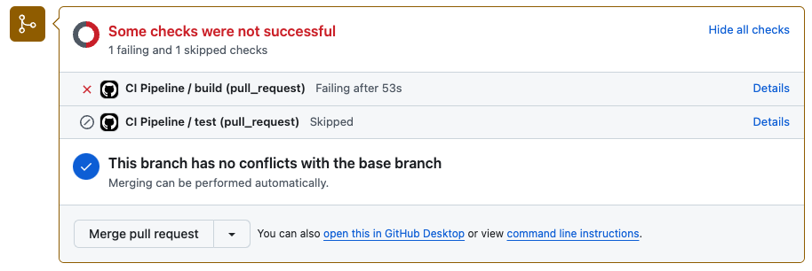

<p align="center">CI 파이프라인 build 실패</p>

**테스트 코드가 실패하니 빌드도 실패**하는 것을 확인할 수 있습니다. `test` Job도 `build`에 의존하고 있기 때문에 `build`에서 실패하니 `test`도 수행되지 못합니다.

로그를 살펴봅시다.

<br>

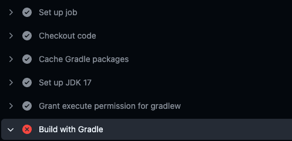

<p align="center">통과한 Step과 실패한 Step을 확인 가능</p>

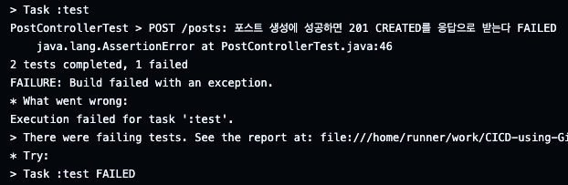

<p align="center">테스트 코드가 실패했다는 것을 확인 가능</p>

<br>

현재 상황은 `dev` → `test`로 **PR 요청 중에 CI 파이프라인이 실패하여 PR 통과가 안되는 상황**입니다. 이번에는 테스트를 통과하도록 코드를 수정하고, `dev` 브랜치로 푸시를 넣어봅시다.

<br>

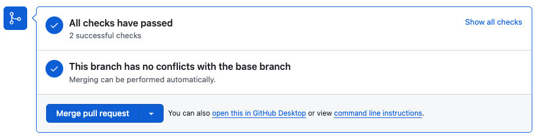

<p align="center">테스트 코드가 깨지지 않기 때문에 이번엔 성공!</p>

<br>

---

## ☑️ 조건문 사용하기

조건문을 사용해서 특정 브랜치에 대해서만 실행되는 Job을 정의해봅시다. 다음과 같은 상황이라고 가정합시다.

* 모든 브랜치에 대해서 PR 요청이 들어가면 하면 `build` Job 수행
* `dev` 브랜치에 푸시가 일어나면 `test` Job 수행

<br>

```yaml
name: CI Pipeline

on:
  pull_request:
    branches:
      - '**'  # 모든 브랜치에 대해 PR이 생성될 때 실행

  push:
    branches:
      - dev  # dev 브랜치에 푸시될 때 실행

jobs:
  build:
    runs-on: ubuntu-latest

    steps:
			# 기존 Step들
			# 체크아웃, JDK 설치, 캐싱, 권한...

      - name: Build with Gradle
        run: ./gradlew build --no-daemon

  test:
    runs-on: ubuntu-latest
    if: github.ref == 'refs/heads/dev'  # dev 브랜치로 푸시될 때만 실행하는 조건문
    steps:
			# 기존 Step들
			# 체크아웃, JDK 설치...

      - name: Run tests
        run: ./gradlew test --no-daemon
```

* `if:`를 통해서 조건문을 사용할 수 있습니다
* `if: github.ref == 'refs/heads/dev'`: `dev` 브랜치로 푸시될 때만 해당 Job이 실행되도록 합니다

<br>

위의 케이스 말고도 다음과 같은 케이스에서도 활용 가능합니다.

* **상태 기반의 조건문**
  * `success()`: 이전 모든 Step이 성공한 경우 참(`true`)
  * `failure()`: 이전 Step 중 하나라도 실패한 경우 참(`true`)
  * `always()`: 모든 조건에 관계없이 항상 참(`true`)
  * `cancelled()`: 워크플로우가 취소된 경우 참(`true`)
* **브랜치 기반 조건문**
  * `github.ref`: 참조를 나타내며, 특정 브랜치나 태그에서만 **Step**을 실행하도록 조건을 설정합니다
  * 예시: `github.ref == 'refs/heads/main'` (main 브랜치에서만 실행)
* **환경 변수 또는 시크릿 기반 조건문**
  * 환경 변수나 시크릿 값을 비교하여 조건을 설정할 수 있습니다
  * 예시: `if: env.MY_ENV_VAR == 'production'`
  * 당연히 `env`에 환경 변수를 정의하거나, 시크릿에 등록해야 합니다
* **결과 기반 조건문**
  * 이전 `Job`의 결과에 따라 실행할 수 있습니다
  * 예시: `needs.job1.result == 'success'` (job1이 성공한 경우)

<br>

---

## 💬 슬랙으로 알림 설정하기(Secrets 사용해보기)

**시크릿(Secrets)**의 사용법에 대해 알아봅시다. CI/CD 파이프라인을 구성하면 대부분 경우 **외부 API, 서버 등과 요청/응답을 주고 받는 과정이 포함**됩니다. 하지만 API 또는 서버와 통신하기 위해서 **YAML** 파일에 URL 또는 API 키를 **그대로 하드 코딩하는 것은 보안에 민감한 정보를 그대로 노출시키는 것**입니다.시크릿은 **API 키, URL, 비밀번호와 같은 민감한 정보를 안전하게 보관**하는데 사용됩니다.

CI 파이프라인이 **실패하거나 성공하면 Slack Notification을 보내는 기능을 추가**해보면서 시크릿을 사용해봅시다.

<br>

### 슬랙 채널 추가

먼저 사용할 슬랙 워크스페이스 내에서 **알림을 받을 채널을 개설**합니다(필요한 경우 워크스페이스 부터 만들어요).

<br>

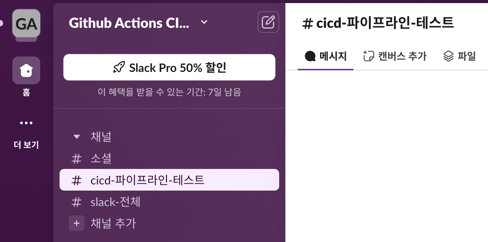

<p align="center">슬랙 채널 개설</p>

* `cicd 파이프라인 테스트`라는 채널을 추가했습니다

<br>

---

### 슬랙 앱 생성: Webhook URL 발급

GitHub Action을 이용한 파이프라인의 통과 여부에 대한 결과를 받기 위해서 **슬랙 앱**을 만들고 **Slack Webhook URL**을 통해 연동할 것입다. 이 **Webhook URL**이 우리가 보관할 시크릿이 될 겁니다.

다음 링크에 들어가서 슬랙 앱을 만들 수 있습니다. [https://api.slack.com/apps](https://api.slack.com/apps)

**Create New App**을 누르고 **From Scratch**를 고릅니다.

<br>

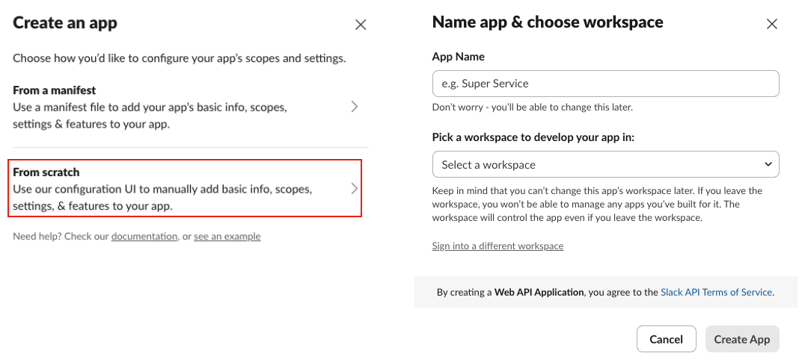

<p align="center">슬랙 앱 생성</p>

* 앱의 이름과 앱을 사용할 워크스페이스-채널을 선택합니다

<br>

---

### 시크릿 등록

앱의 생성을 완료했으면, 해당 앱의 설정 페이지에서 **Incoming Webhooks**를 선택하고 활성화 시킵니다. 그리고 **Webhook URL**을 복사합니다.

<br>

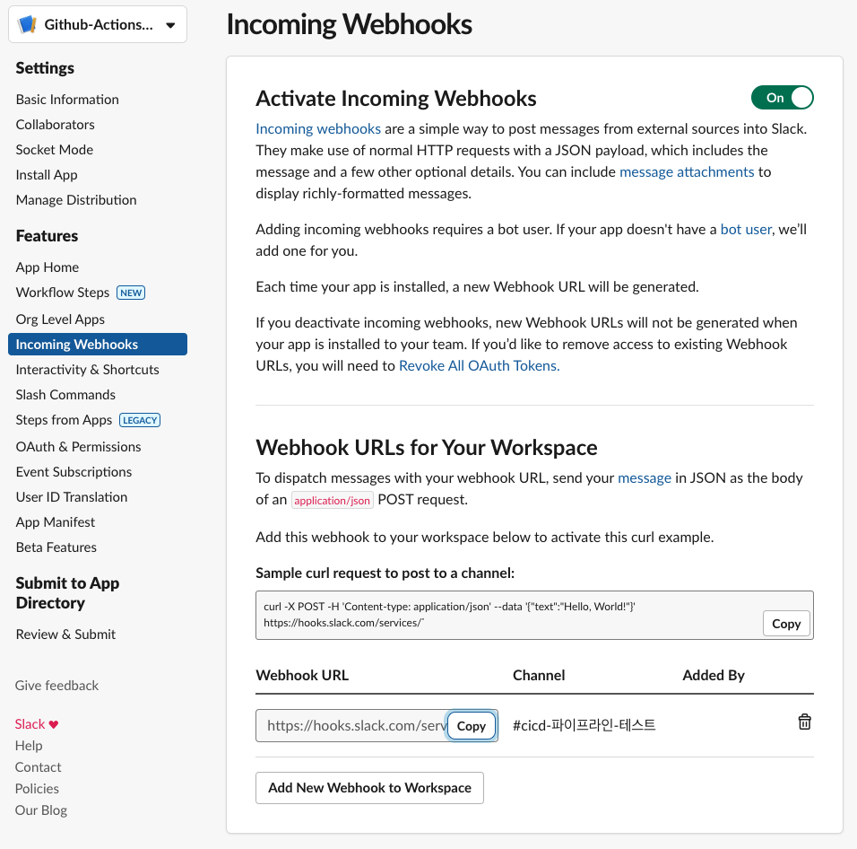

<p align="center">Webhook URL 복사</p>

<br>

복사한 **Webhook URL**은 깃헙 레포지토리의 **Settings > Secrets and variables > Actions**에 들어가서 **New repository secret**에 추가합니다.

<br>

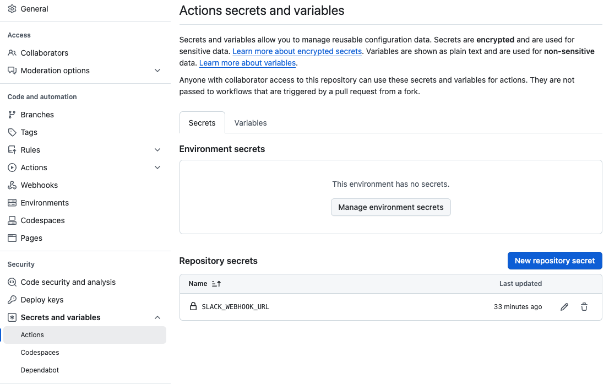

<p align="center">Webhook URL을 Secret으로 추가</p>

<br>

해당 시크릿은 GitHub Action 워크플로우에서 `${{ secrets.SLACK_WEBHOOK_URL }}`과 같은 형태로 사용할 수 있습니다.

<br>

---

### 워크플로우 작성1: `slack-github-action`(현재 버그 있음)

이제 기존의 `ci.yml`에 슬랙 알림을 보내는 작업을 추가해봅시다. [slackapi/slack-github-action](https://github.com/slackapi/slack-github-action)을 사용할 것입니다.

<br>

> **버그**
>
> 현재 이 방법은 `payload-file-path`를 사용하는 경우 필드가 `???`로 표시되는 버그가 있습니다!
>
> [159#discussion](https://github.com/slackapi/slack-github-action/pull/159#discussion_r1120736821) 참고

<br>

```yaml
# 6. 슬랙 채널로 빌드의 성공 또는 실패에 따라 알림 보내기
# 성공시 슬랙 알람 보내기
- name: Notify Slack on Success
  if: success() # 이전 스텝이 모두 성공하면 해당 스텝을 실행하는 조건문
  id: slack-success
  uses: slackapi/slack-github-action@v1.27.0
  with:
    payload-file-path: "./slack/success-payload-content.json" # 미리 정의된 json 파일에 payload를 정의해서 사용가능
    # payload를 json 형태로 직접 제공해서 사용할 수 있다
    # payload는 payload-file-path 보다 높은 우선순위를 가진다
    # payload: |
    #      {
    #        "key": "value",
    #        "foo": "bar"
    #      }
  env:
    SLACK_WEBHOOK_URL: ${{ secrets.SLACK_WEBHOOK_URL }}
    SLACK_WEBHOOK_TYPE: INCOMING_WEBHOOK
# 실패시 슬랙 알람 보내기
- name: Notify Slack on Failure
  if: failure() # 이전 스텝 중 하나라도 실패하면 해당 스텝을 실행하는 조건문
  id: slack-failure
  uses: slackapi/slack-github-action@v1.27.0
  with:
    payload-file-path: "./slack/failure-payload-content.json"
  env:
    SLACK_WEBHOOK_URL: ${{ secrets.SLACK_WEBHOOK_URL }}
    SLACK_WEBHOOK_TYPE: INCOMING_WEBHOOK
```

* 파이프라인 성공과 실패를 나누어서 `success-payload-content.json`와 `failure-payload-content.json`를 따로 정의해서 사용하고 있습니다
* `payload` 필드를 사용해서 바로 정의해서 사용하는 방법도 존재합니다(현재 이 방법은 버그가 없음)

<br>

그러면  `success-payload-content.json`을 한번 살펴봅시다.

```yaml
{
  "channel": "C07L4BQTKGE",
  "attachments": [
    {
      "color": "#36a64f",
      "title": "${{ github.repository }}",
      "title_link": "https://github.com/${{github.repository}}",
      "text": "✅ CI/CD 파이프라인 성공",
      "fields": [
        {
          "title": "Repository",
          "value": "${{ github.repository }}",
          "short": true
        },
        {
          "title": "Tag",
          "value": "${{ github.ref_name }}",
          "short": true
        },
        {
          "title": "Commit",
          "value": "${{ github.sha }}",
          "short": true
        },
        {
          "title": "Commit Message",
          "value": "${{ github.event.head_commit.message }}",
          "short": true
        },
        {
          "title": "Author",
          "value": "${{ github.event.head_commit.author.name }}",
          "short": true
        }
      ]
    }
  ]
}
```

* 위 케이스에서는 채널 ID를 그대로 노출했지만, 해당 ID도 시크릿에 등록해서 사용할 수 있습니다

<br>

이 방법의 경우 아래 처럼 필드가 `???`로 랜더링 버그가 있습니다.

(`@v1.27.0` 기준. Maintainer들이 현재 해결 방법을 찾아보고 있는 것 같습니다. 언제 해결 될지는 😭)

<br>

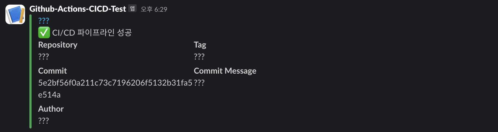

<br>

---

### 워크플로우 작성2: `slack-github-action`(버그 우회)

> **버그 우회(Workaround)**
>
> 이 방법은 버그 해결이 아닌 우회하는 방법입니다.
>
> [Problems persist using payload file #203](https://github.com/slackapi/slack-github-action/issues/203) 참고

<br>

이슈에서 나온 우회 방법을 그대로 첨부했습니다.


<details>
  <summary>ci.yml</summary>

```yaml
# 추가 1
env:
  PULL_REQUEST_TITLE: ${{ github.event.pull_request.title }}
  PULL_REQUEST_URL: ${{ github.event.pull_request.html_url }}
  PULL_REQUEST_AUTHOR: ${{ github.event.pull_request.user.login }}
  PULL_REQUEST_EVENT_NAME: ${{ github.event_name }}
  PULL_REQUEST_LOGS_URL: ${{ github.event.repository.html_url }}/actions/runs/${{ github.run_id }}
  PULL_REQUEST_COMMIT_URL: ${{ github.event.pull_request.head.repo.html_url }}/commit/${{ github.event.pull_request.head.sha }}
  
jobs:
  # Build Job
  build:
    runs-on: ubuntu-latest
			
    steps:
    # 기존 Step
    
      # 추가 2
      - name: Slack message with build result
        if: success() || failure()
        uses: slackapi/slack-github-action@v1.27.0
        env:
          SLACK_WEBHOOK_URL: ${{ secrets.SLACK_WEBHOOK_URL }}
          SLACK_WEBHOOK_TYPE: INCOMING_WEBHOOK
          PULL_REQUEST_JOB_STATUS: ${{ job.status }}
          PULL_REQUEST_JOB_STATUS_COLOR: ${{ job.status == 'success' && vars.COLOR_GREEN || job.status == 'failure' && vars.COLOR_RED || vars.COLOR_ORANGE }}
        with:
          channel-id: C07L4BQTKGE
          payload-file-path: ./slack/ci_slack_message.json
```

</details>


<details>
  <summary>ci_slack_message.json</summary>

```yaml
{
  "attachments": [
    {
      "color": "${{ env.PULL_REQUEST_JOB_STATUS_COLOR }}",
      "fallback": "test",
      "blocks": [
        {
          "type": "section",
          "fields": [
            {
              "type": "mrkdwn",
              "text": "*Pull Request:*\n<${{ env.PULL_REQUEST_URL }}|${{ env.PULL_REQUEST_TITLE }}>"
            },
            {
              "type": "mrkdwn",
              "text": "*Status:*\n`${{ env.PULL_REQUEST_JOB_STATUS }}`"
            }
          ]
        },
        {
          "type": "section",
          "fields": [
            {
              "type": "mrkdwn",
              "text": "*Author:*\n`${{ env.PULL_REQUEST_AUTHOR }}`"
            },
            {
              "type": "mrkdwn",
              "text": "*Event:*\n`${{ env.PULL_REQUEST_EVENT_NAME }}`"
            }
          ]
        },
        {
          "type": "divider"
        },
        {
          "type": "actions",
          "elements": [
            {
              "type": "button",
              "text": {
                "type": "plain_text",
                "text": "Logs"
              },
              "url": "${{ env.PULL_REQUEST_LOGS_URL }}"
            },
            {
              "type": "button",
              "text": {
                "type": "plain_text",
                "text": "Commit"
              },
              "url": "${{ env.PULL_REQUEST_COMMIT_URL }}"
            }
          ]
        }
      ]
    }
  ]
}
```

</details>

<br>

이 경우 다음과 같이 표시됩니다.

<br>

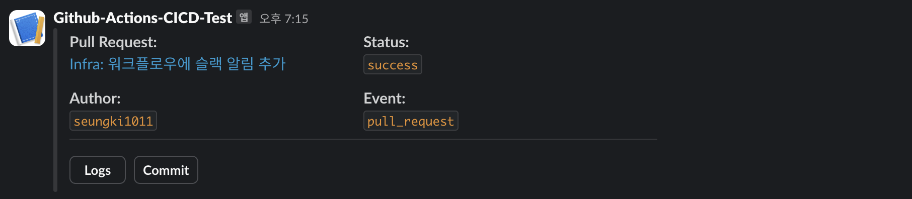

<br>

---

### 워크플로우 작성3: `action-slack`

이번에는 더 간편한 방법인 [8398a7/action-slack](https://github.com/8398a7/action-slack)를 사용하는 방법에 대해 알아봅시다.

아래의 **Step**만 추가하면 됩니다.

<br>

```yaml
- name: Slack message with build result
  if: always() # 이전의 Step들의 성공과 실패 여부에 상관 없이 항상 실행
  uses: 8398a7/action-slack@v3
  with:
    status: ${{ job.status }}
    fields: repo,message,commit,author,action,eventName,ref,workflow,job,took
    if_mention: failure,cancelled
  env:
    SLACK_WEBHOOK_URL: ${{ secrets.SLACK_WEBHOOK_URL }}
```

<br>

다음과 같은 슬랙 알람을 받을 수 있습니다.

<br>

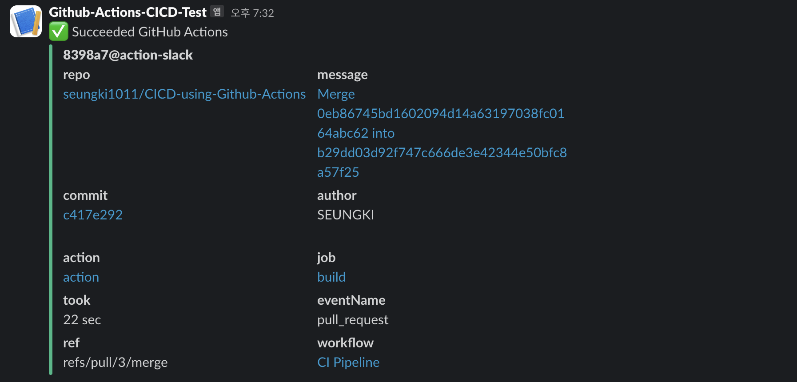

<br>

이 방법은 간편하지만 `slack-github-action`에 비해 필드를 원하는데로 커스터마이징 하기가 어렵다는 단점이 있습니다.

<br>

---

## 📑 Reference

1. [https://pozafly.github.io/dev-ops/cache-and-restore-keys-in-github-actions/](https://pozafly.github.io/dev-ops/cache-and-restore-keys-in-github-actions/)
2. [https://fe-developers.kakaoent.com/2022/220106-github-actions/](https://fe-developers.kakaoent.com/2022/220106-github-actions/)
3. [https://hyperconnect.github.io/2021/11/08/github-actions-for-everyone-1.html](https://hyperconnect.github.io/2021/11/08/github-actions-for-everyone-1.html)
4. [https://github.com/8398a7/action-slack](https://github.com/8398a7/action-slack)
5. [https://github.com/slackapi/slack-github-action](https://github.com/slackapi/slack-github-action)
